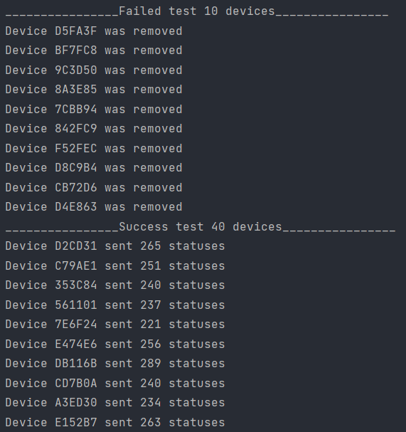

# Ajax: Python Developer in Test

## The main tasks:
* Implement a function that considers number of messages with handler
'BIG' for each sensor that is OK. Sensors, sending STATE:DD - no need to count.
* Count the number of sensors that passed the test and the number of sensors that failed.

## Cases to cover with tests:
* Scan QR codes of different lengths that are in the database and check whether the program
assigns the correct color depending on the length of the QR code.
* You have a negative case in which you scan a QR code for the length which has no color.
* Check the QR scan which is not in the database.
* Write tests for the case of a failed scan and check that the method
send_error is called with the required arguments.
* Write tests for a successful scan and check that the can_add_device function
returns a message if the scan is successful (it should be implemented as a previous test)

Output for the first task:

